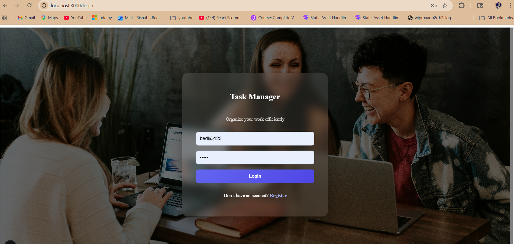
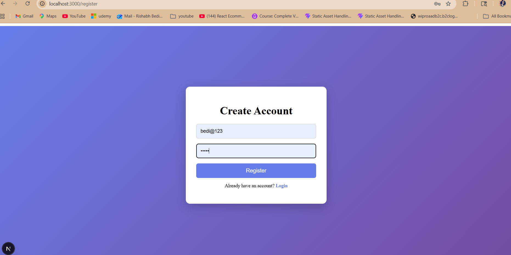
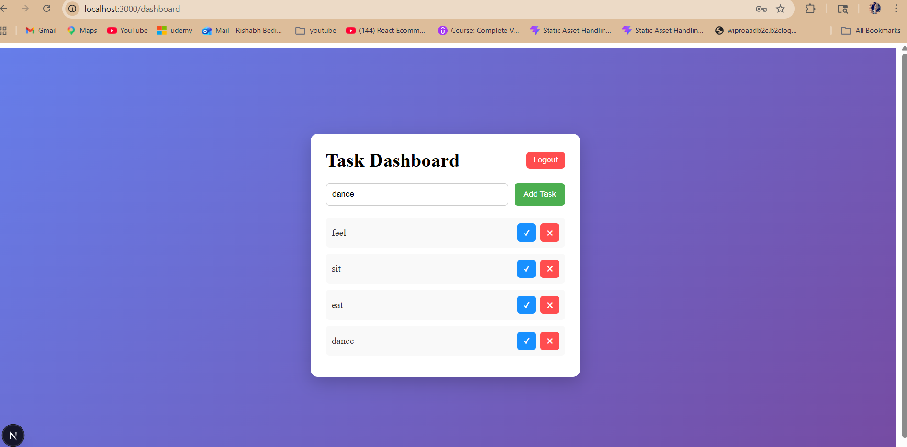

# 📝 Task Management System

A full-stack Task Management System that allows users to securely manage their daily tasks with authentication, filtering, and real-time updates.

Built using modern technologies with a focus on scalability, clean architecture, and user experience.

---

## 🚀 Features

### 🔐 Authentication & Security
- User Registration & Login
- Password hashing using bcrypt
- JWT Authentication (Access + Refresh Tokens)
- Protected routes using middleware

### 📋 Task Management (CRUD)
- Create tasks
- View all user-specific tasks
- Update tasks
- Delete tasks
- Toggle task completion

### 🔍 Advanced Features
- Pagination
- Search tasks by title
- Filter by status (Completed / Pending)

### 💻 UI/UX
- Clean and modern interface
- Fully responsive (desktop + mobile)
- Glassmorphism login/register UI

---

## 🛠️ Tech Stack

### Backend
- Node.js
- Express.js
- TypeScript
- Prisma ORM
- PostgreSQL

### Frontend
- Next.js (App Router)
- TypeScript
- Axios
- CSS Modules

---

## 📂 Project Structure
task-management/
│
├── task-management-backend/
│ ├── src/
│ │ ├── controllers/
│ │ ├── routes/
│ │ ├── middleware/
│ │ ├── utils/
│ │ └── index.ts
│ └── prisma/
│
├── task-frontend/
│ ├── app/
│ │ ├── login/
│ │ ├── register/
│ │ ├── dashboard/
│ └── lib/

## 📸 Screenshots

### 🔐 Login Page

  

---

### 📝 Register Page

  

---

### 📊 Dashboard

  

